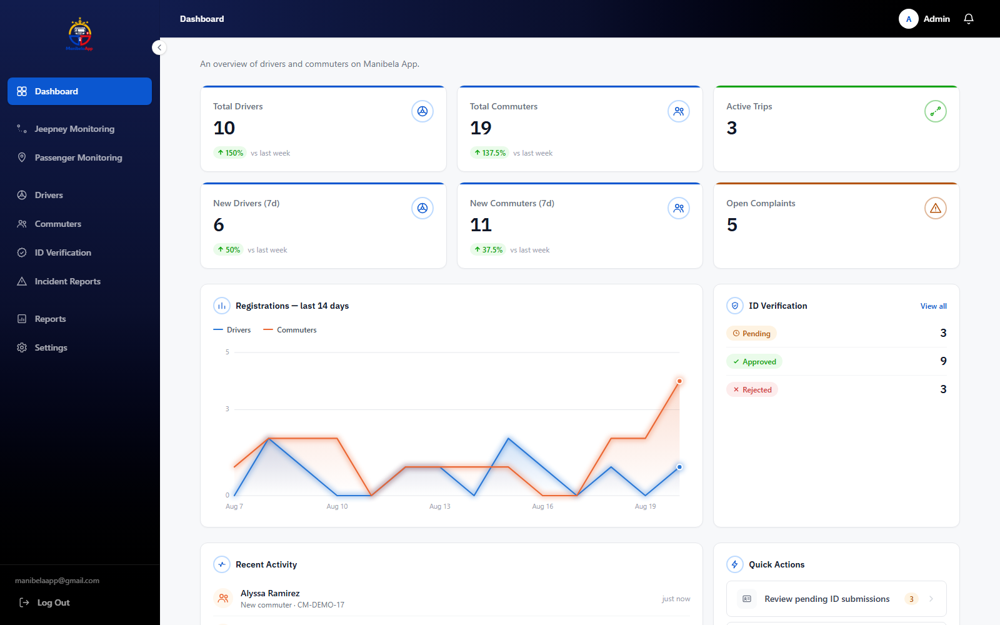
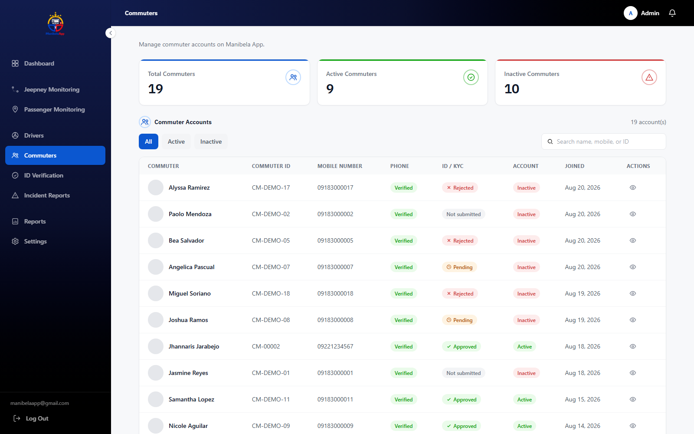
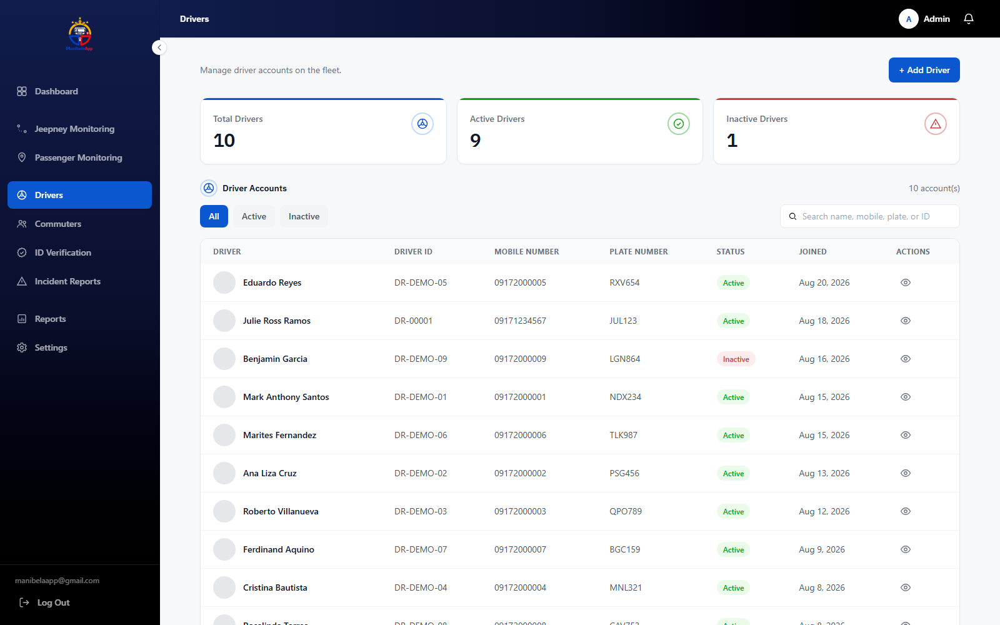
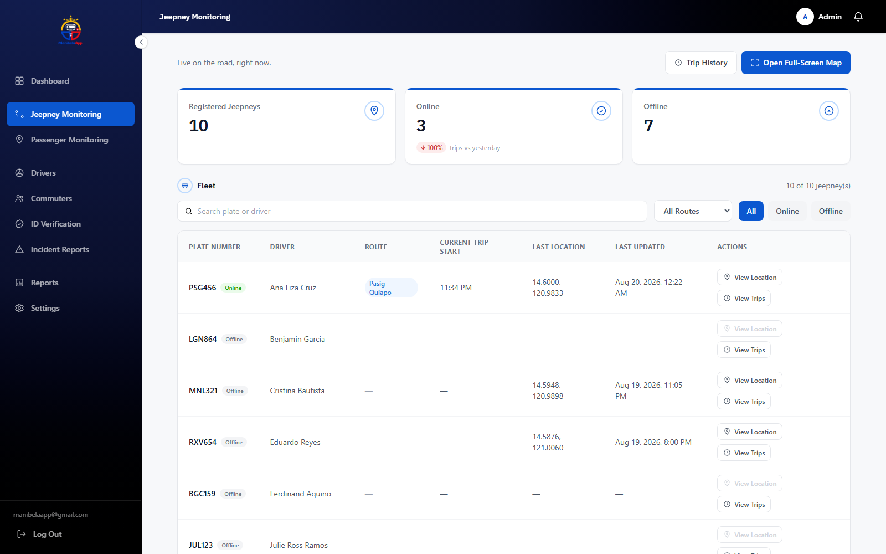
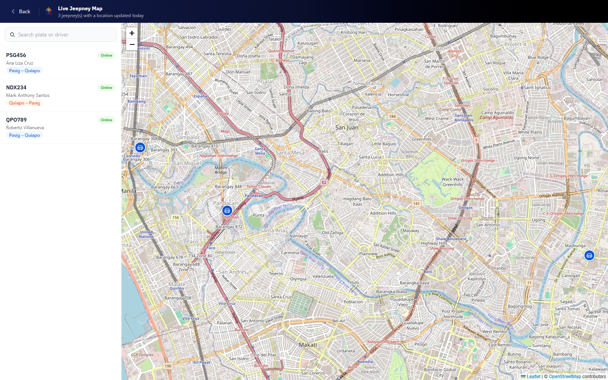

# ManibelApp Admin

The admin website for ManibelApp — verifies commuter IDs, manages driver
accounts, reviews flagged trips and complaints, and monitors live
jeepney/passenger activity on the Pasig–Quiapo route.

React 19 + TypeScript, built with Vite, styled with Tailwind CSS 4. Talks
to the ManibelApp backend's REST API, which defaults to
`http://localhost:4000` — set `VITE_API_BASE_URL` in a `.env` file to
point at a different host.

## Commands

```bash
npm install
npm run dev      # dev server at http://localhost:5173
npm run build    # typecheck (tsc -b) + production build
npm run lint     # oxlint
npm run preview  # preview a production build locally
```

## Screenshots

### Login


### Dashboard


### Commuter Management


### Driver Management


### Jeepney Monitoring


### Live Map

